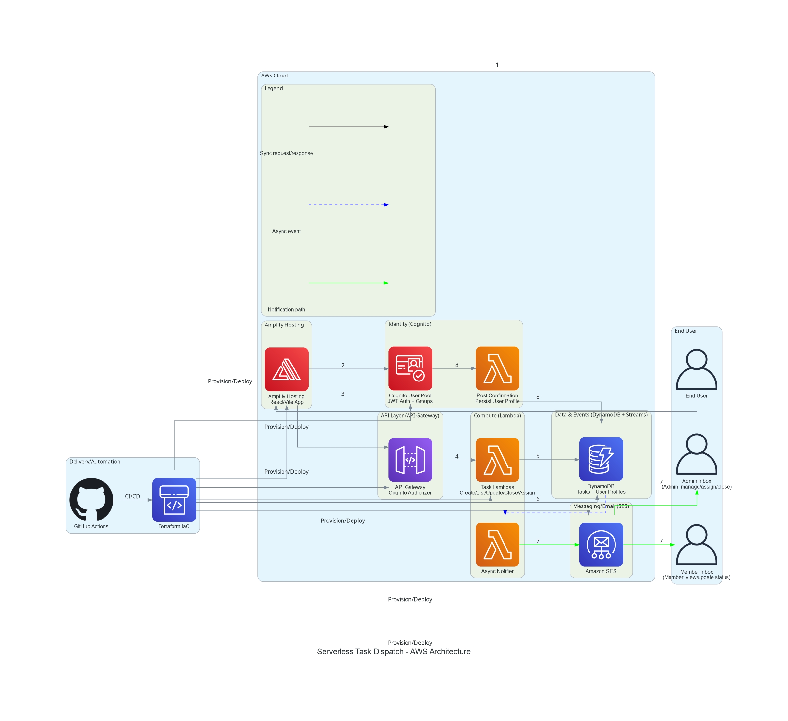

# Serverless Dispatch

<video src="assets/video/demo.mp4" autoplay muted loop playsinline controls></video>

Serverless task dispatch platform with a React/Vite frontend, Cognito-backed JWT authentication, and an AWS Lambda + API Gateway backend. The system implements role-based access for admins and members and emits event-driven notifications on task changes.

## Architecture Diagram



## Core Features

- Role-based access control for Admin and Member users.
- JWT authorization via Amazon Cognito User Pools and API Gateway authorizer.
- Task operations implemented as AWS Lambda functions.
- DynamoDB Streams trigger asynchronous notifications delivered through SES.
- Infrastructure as Code with Terraform and GitHub Actions CI/CD.

## Technology Stack

- Frontend: React, Vite, TypeScript
- Auth: Amazon Cognito User Pool (JWT)
- API: Amazon API Gateway
- Compute: AWS Lambda (Go)
- Data: Amazon DynamoDB + Streams
- Messaging: Amazon SES
- IaC: Terraform
- CI/CD: GitHub Actions

## Repository Layout

- diagram-engine-room/: architecture diagram source and generator
- frontend/: web client (React/Vite)
- functions/: Lambda functions and Go modules
- scripts/terraform/: Terraform configurations and state artifacts

## Prerequisites

- Node.js 18+ and npm for the frontend
- Go 1.20+ for Lambda sources
- Terraform 1.5+ for infrastructure provisioning
- AWS account with permissions for API Gateway, Lambda, DynamoDB, Cognito, SES, and IAM
- AWS CLI v2 configured for local Terraform usage

## Local Development

### Frontend

```bash
cd frontend
npm install
npm run dev
```

### Backend (Lambda)

Lambda sources are under functions/ and organized by service/domain. Build and deploy through the Terraform workflow or your CI/CD pipeline.

## Infrastructure Provisioning

Terraform configurations are under scripts/terraform/infra. Use a remote state backend and a tfvars file per environment.

```bash
cd scripts/terraform/infra
terraform init -backend-config=dev.tfbackend
terraform plan -out=tfplan -var-file=dev.tfvars
terraform apply tfplan
```

## CI/CD Secrets

Configure these GitHub Actions secrets for .github/workflows/deploy.yml:

- AWS_ROLE_ARN: IAM role ARN assumed by GitHub Actions via OIDC.
- TF_STATE_BUCKET: S3 bucket name for Terraform state.
- TF_DEV_TFVARS: contents of scripts/terraform/infra/dev.tfvars (multiline secret).
- COGNITO_USER_POOL_ID: Cognito User Pool ID mapped to TF_VAR_user_pool_id.

## Pipeline Notes

- COGNITO_USER_POOL_ID is injected as TF_VAR_user_pool_id and used to configure the notification Lambda.
- The infra-plan and infra-deploy jobs fail fast if COGNITO_USER_POOL_ID is missing.

## Diagram Generation

The architecture diagram is generated with the Python diagrams library.

```bash
cd diagram-engine-room
python architecture_diagram.py
```

The output image is saved as diagram-engine-room/serverless-task-dispatch-arch.png.
